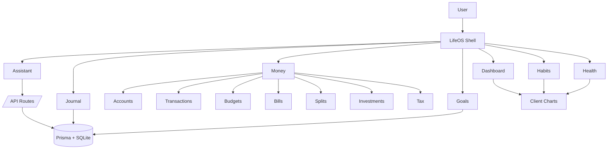
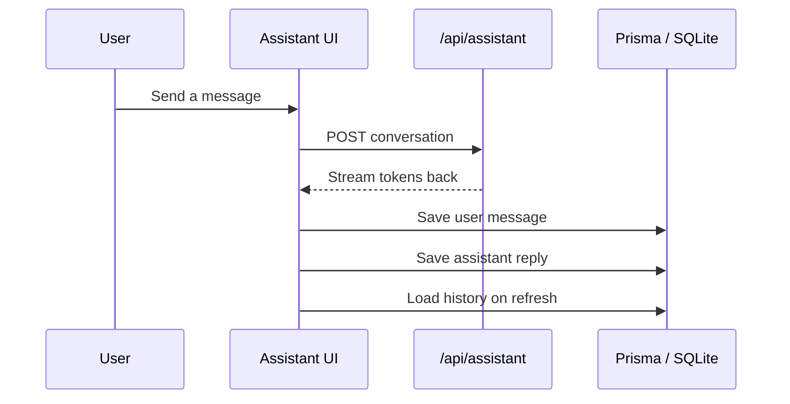

<p align="center">
  <defs><linearGradient id='g' x1='0' y1='0' x2='1' y2='1'><stop offset='0%' stop-color='%2317e5c5'/><stop offset='50%' stop-color='%23256dff'/><stop offset='100%' stop-color='%23ff4db8'/></linearGradient><filter id='s' x='-20%' y='-20%' width='140%' height='140%'><feGaussianBlur stdDeviation='24' result='b'/><feColorMatrix in='b' type='matrix' values='1 0 0 0 0 0 1 0 0 0 0 0 1 0 0 0 0 0 .7 0'/></filter></defs><rect width='1200' height='320' fill='%230a1020'/><circle cx='170' cy='92' r='86' fill='%2317e5c5' opacity='.14'/><circle cx='1030' cy='230' r='110' fill='%23ff4db8' opacity='.12'/><circle cx='930' cy='86' r='14' fill='%23ff4db8' opacity='.8'><animateTransform attributeName='transform' type='translate' values='0 0;0 18;0 0' dur='3s' repeatCount='indefinite'/></circle><circle cx='202' cy='86' r='20' fill='%2317e5c5' opacity='.85'><animateTransform attributeName='transform' type='translate' values='0 0;0 -12;0 0' dur='2.4s' repeatCount='indefinite'/></circle><text x='80' y='156' fill='url(%23g)' font-family='Inter,Segoe UI,Arial,sans-serif' font-size='76' font-weight='800'>LifeOS</text><text x='82' y='206' fill='%23dbe7ff' font-family='Inter,Segoe UI,Arial,sans-serif' font-size='22'>A personal operating system for money, habits, health, journaling, goals, and assistant workflows.</text><rect x='80' y='242' rx='16' ry='16' width='470' height='34' fill='%23131d33' stroke='%23394a72'/><text x='100' y='264' fill='%2396b4ff' font-family='Inter,Segoe UI,Arial,sans-serif' font-size='16'>Streaming assistant • Prisma • Next.js App Router • Visual dashboards</text></svg>"
    style="max-width: 100%; border-radius: 18px;"
  />
</p>

<p align="center">
  <a href="https://github.com/adirane45/LifeOS"></a>
  <a href="https://nextjs.org/"></a>
  <a href="https://www.prisma.io/"></a>
  <a href="https://www.typescriptlang.org/"></a>
</p>

<p align="center">
  Dashboard for personal tracking with money, habits, health, journal, goals, and an assistant that can stream answers and remember conversation history.
</p>

<p align="center">
  <a href="#what-it-does">What It Does</a> · <a href="#visual-map">Visual Map</a> · <a href="#stack-at-a-glance">Stack</a> · <a href="#getting-started">Getting Started</a> · <a href="#scripts">Scripts</a>
</p>

---

## What It Does

LifeOS combines several daily-life surfaces into one workspace so you can move from tracking to action without switching apps.

- Money management with accounts, transactions, budgets, bills, splits, investments, tax, and net worth views.
- Habits, goals, and health tracking with charts, streaks, and progress views.
- Journal capture with history, mood context, and quick review.
- Assistant chat with streaming responses and persisted conversation history.

---

## Visual Map

### App Surface



### Assistant Flow



---

## Feature Matrix

| Area | Highlights |
| --- | --- |
| Dashboard | At-a-glance overview with fast navigation across the product. |
| Money | Accounts, transactions, budgets, bills, tax, splits, and net worth tracking. |
| Habits | Streaks, completion history, and visual progress cues. |
| Health | Metric tracking with charts and trend analysis. |
| Journal | Entry creation, editing, and long-term reflection. |
| Goals | Structured goal tracking with categories and progress updates. |
| Assistant | Streaming chat responses, persisted history, and clear-history support. |

---

## Stack At A Glance

| Layer | Tools |
| --- | --- |
| Frontend | Next.js App Router, React, TypeScript |
| Styling | Tailwind CSS, Framer Motion, Lucide React |
| Charts | Recharts |
| Database | Prisma, SQLite, better-sqlite3 adapter |
| AI | OpenAI-compatible integrations, Groq, Cohere, Google Generative AI |
| UX | react-hot-toast, confirm dialogs, client/server component split |

---

## Getting Started

1. Install dependencies.

```bash
npm install
```

2. Add environment variables in `.env.local`.

At minimum you need `DATABASE_URL`. Add one or more AI provider keys depending on the features you want to use.

| Variable | Purpose |
| --- | --- |
| `DATABASE_URL` | Prisma database connection string, for example `file:./dev.db` |
| `GROQ_API_KEY` | Groq/OpenAI-compatible assistant access |
| `OPENAI_API_KEY` | Optional assistant fallback |
| `COHERE_API_KEY` | Optional provider support |

3. Push the Prisma schema to your database.

```bash
npx prisma db push
```

4. Start the app.

```bash
npm run dev
```

If you are on Windows and PowerShell gives you profile or terminal warnings, `cmd /c npm run dev` is a reliable fallback.

---

## Scripts

| Command | Purpose |
| --- | --- |
| `npm run dev` | Start the local development server |
| `npm run build` | Build the production bundle |
| `npm run start` | Run the production server |
| `npm run prisma:generate` | Regenerate the Prisma client |
| `npm run prisma:migrate` | Create and apply a migration |

---

## Project Layout

```text
app/         routes, server actions, API endpoints
components/  UI building blocks, charts, and client wrappers
lib/         data access, assistant tools, utilities
prisma/      schema and migrations
styles/      global styling
```

---

## Development Notes

- Server pages fetch and shape data before rendering, which keeps the initial load fast and consistent.
- Chart-heavy components are isolated behind client wrappers so the server can stream the rest of the page early.
- The assistant page restores conversation history from the database and saves messages after the streamed reply completes.
- The UI is designed to stay usable even when a section has no data yet; empty states are shown instead of broken views.

---

## Validation

The current workspace has been validated with:

```bash
npm run build
```

---

## License

MIT

---

<p align="center">
  Built for a personal operating system that feels responsive, visual, and calm to use.
</p>
