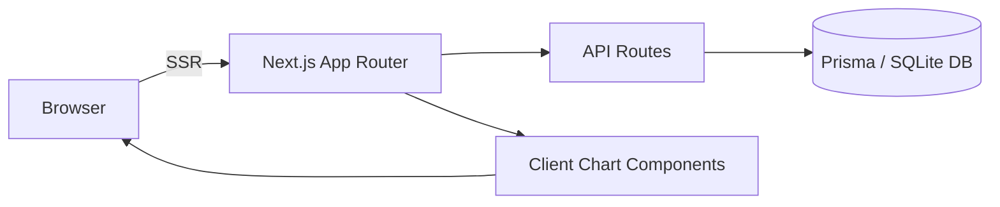

---

<!-- PREMIUM README: modern, neon-styled, developer friendly -->

<p align="center">
  <!-- Animated neon header (SVG) -->
  <defs><linearGradient id='a' x1='0' x2='1'><stop offset='0' stop-color='%2300ffd5'/><stop offset='1' stop-color='%23ff00ba'/></linearGradient><style>text{font-family:Inter,-apple-system,Segoe UI,Roboto,Helvetica,Arial,sans-serif;font-weight:800;fill:url(%23a);font-size:54px;letter-spacing:1px;filter:drop-shadow(0 18px 36px rgba(0,0,0,.6));} .sub{font-size:16px;fill:%23cbd5e1;font-weight:600;} .pulse{animation:pulse 2.8s infinite;} @keyframes pulse{0%{opacity:.85;transform:translateY(0)}50%{opacity:1;transform:translateY(-2px)}100%{opacity:.85;transform:translateY(0)}}</style></defs><rect width='100%' height='100%' fill='%23061217'/><g transform='translate(48,72)'><text x='0' y='64'>LifeOS</text><text class='sub' x='0' y='96'>Personal OS — money · habits · health · journal · goals</text><g transform='translate(560,36)'><circle cx='40' cy='10' r='10' fill='%23ff7ab6' class='pulse'/></g></g></svg>" style="max-width:100%;border-radius:12px;" />
</p>

<p align="center">
  <a href="https://github.com/adirane45/LifeOS"></a>
  <a href="https://github.com/adirane45/LifeOS/network/members"></a>
  <a href="https://github.com/adirane45/LifeOS/actions"></a>
  <a href="https://github.com/adirane45/LifeOS"></a>
</p>

<p align="center">
  <a href="#project-preview">Preview</a> · <a href="#features">Features</a> · <a href="#architecture--workflow">Architecture</a> · <a href="#installation">Install</a>
</p>

---

## About

**Project Name:** LifeOS  
**Tagline:** Personal OS for Life — track money, habits, health, journal, and goals  
**Type:** Web App (Next.js App Router)  

LifeOS is a unified personal dashboard built with Next.js and TypeScript that helps you organize finances, health metrics, habits, journaling, and goals — all from one fast, privacy-first interface.

### Quick Links

- Repo: https://github.com/adirane45/LifeOS
- Demo: (add demo link)
- Website: (add website link)

---

## Project Preview


<details>
<summary>More screenshots</summary>

| Desktop | Mobile |
|---|---|
|  |  |

</details>

---

## Features

| Feature | Description |
|---|---|
| 🧭 Unified Dashboard | Integrates finances, habits, health, goals, journal and assistant in one place. |
| 💸 Money Tracking | Accounts, budgets, transactions and net worth charts. |
| ✅ Habits & Goals | Streaks, heatmaps, and goal progress tracking. |
| 📈 Health Metrics | Track weight, sleep, heart rate and trends over time. |
| ✍️ Journal | Private entries with mood tracking. |
| 🤖 Assistant Chat | Natural conversation to log data and get insights. |

---

## Tech Stack

Front-end:  `Next.js (App Router)`, `React`, `TypeScript`  
Styling:  `Tailwind CSS`  
Database:  `Prisma` + `SQLite`  
Charts & UI: `Recharts` / `Chart.js`, `Radix UI`, `Lucide`  
Dev & CI: `pnpm` / `npm`, `Turbopack`, `ESLint`, `GitHub Actions`  

---

## Architecture & Workflow



---

## Installation

```bash
git clone https://github.com/adirane45/LifeOS.git
cd LifeOS
pnpm install # or npm install
npm run dev
```

On Windows, if you previously had PowerShell profile warnings, run the dev server with:

```powershell
cmd /c npm run dev
```

---

## Contributing

Contributions welcome — open issues and PRs. Please follow the contribution guidelines and run `pnpm lint` and tests before opening a PR.

---

## License

MIT © Adriane


### 🎪 Goal Tracking

1. Navigate to **Goals**
2. Create goals across FINANCE, HABIT, HEALTH, OTHER categories
3. Update progress as you work toward them
4. Set target dates for motivation
5. Mark as complete when achieved

### 📔 Journal Writing

1. Navigate to **Journal**
2. Write daily reflections with optional mood tracking
3. View "On This Day" entries from past years
4. Edit or delete entries as needed
5. Export journal entries for backup

### 🤖 AI Assistant

1. Open the **Assistant** chat interface
2. Ask the AI to help with:
   - Adding transactions
   - Logging habits
   - Creating journal entries
   - Getting life insights
3. Natural language understanding processes your requests
4. Real-time streaming responses

---

## ⚙️ Configuration

### Dark Mode

LifeOS automatically detects system preference. Toggle manually in **Settings**.

### Timezone Support

The app respects your system timezone for habit streaks and date calculations. For best results, ensure your device timezone is correctly set.

### Data Export

Export your data anytime:
- **Money**: CSV format with all transactions
- **Health**: CSV with all metrics
- **Journal**: Markdown or PDF format

---

## 🔐 Security & Privacy

- ✅ All data stored locally in SQLite
- ✅ No cloud analytics or tracking
- ✅ Secure password handling with Next.js
- ✅ Environment variables for sensitive data
- ✅ CORS-protected API endpoints
- ✅ WCAG AA accessibility compliant

---

## 🚀 Deployment

### Deploy to Vercel (Recommended)

```bash
# Install Vercel CLI
npm i -g vercel

# Deploy
vercel
```

### Deploy to Other Platforms

LifeOS works on any Node.js 18+ hosting:
- **Railway**
- **Render**
- **Heroku**
- **AWS**
- **Google Cloud**
- **Azure**

### Production Checklist

- [ ] Set `NODE_ENV=production`
- [ ] Configure `GROQ_API_KEY` environment variable
- [ ] Set up proper database (PostgreSQL recommended)
- [ ] Enable HTTPS
- [ ] Configure CORS properly
- [ ] Set up database backups
- [ ] Monitor application logs
- [ ] Enable rate limiting on API routes

---

## 📖 Documentation

### API Documentation

All API endpoints are documented with request/response examples:

```bash
# Get user data
GET /api/accounts/recalculate

# Toggle habit completion
POST /api/habits/[habitId]/toggle

# AI assistant chat
POST /api/assistant

# Export data
GET /api/export/transactions
GET /api/export/health
GET /api/export/journal
```

### Component Documentation

Key components:
- `Button` - Styled button with variants
- `Card` - Content container
- `HabitCheckbox` - Interactive habit completion
- `HealthCharts` - Chart visualizations
- `JournalEntryItem` - Journal entry display
- `AssistantChatComposer` - AI chat input

---

## 🧪 Testing

```bash
# Run linter
npm run lint

# Type check
npx tsc --noEmit

# Build for production
npm run build
```

---

## 🤝 Contributing

Contributions are welcome! Here's how to get started:

1. **Fork** the repository
2. **Create** a feature branch (`git checkout -b feature/amazing-feature`)
3. **Commit** your changes (`git commit -m '✨ Add amazing feature'`)
4. **Push** to the branch (`git push origin feature/amazing-feature`)
5. **Open** a Pull Request

### Commit Message Convention

```
✨ feat: Add new feature
🐛 fix: Fix bug
📚 docs: Update documentation
🎨 style: Improve UI/styling
♻️ refactor: Refactor code
⚡ perf: Performance improvements
🧪 test: Add tests
🔧 chore: Update configuration
```

---

## 📋 Roadmap

- [ ] Mobile app (React Native)
- [ ] Social features (sharing goals with friends)
- [ ] Advanced analytics dashboard
- [ ] Integration with fitness trackers (Fitbit, Oura)
- [ ] Recurring transaction automation
- [ ] Custom recurring patterns
- [ ] Data visualization improvements
- [ ] Multi-user support
- [ ] Cloud sync option
- [ ] Browser extensions

---

## 🐛 Known Issues & Limitations

- Single user per database (multi-user coming soon)
- SQLite not recommended for >100K records
- AI responses depend on API availability
- Mobile app in development

---

## 📄 License

This project is licensed under the **MIT License** - see the [LICENSE](LICENSE) file for details.

---

## 👨‍💻 Author

**Built with ❤️ by developers who believe in life optimization**

---

## 💬 Support & Feedback

- **Issues**: [GitHub Issues](https://github.com/yourusername/lifeos/issues)
- **Discussions**: [GitHub Discussions](https://github.com/yourusername/lifeos/discussions)
- **Email**: support@lifeos.local

---

## 🙏 Acknowledgments

- Built with [Next.js](https://nextjs.org/) and [React](https://react.dev/)
- Styled with [Tailwind CSS](https://tailwindcss.com/)
- AI powered by [Groq](https://groq.com/)
- Icons from [Lucide React](https://lucide.dev/)
- Charts by [Recharts](https://recharts.org/)

---

<div align="center">

### Made with 💜 for personal growth

**[⭐ Star us on GitHub](https://github.com/yourusername/lifeos)** if you find this helpful!

```
╔════════════════════════════════════════════════════════════════╗
║                                                                ║
║     🌟 Transform Your Life Into An Operating System 🌟        ║
║                                                                ║
║                    Start Building Today →                      ║
║                                                                ║
╚════════════════════════════════════════════════════════════════╝
```

[Back to Top](#-lifeos)

</div>


<p align="center">🚀</p>

Your life, quantified. Your assistant, empowered.

## Features

- 🧭 **Dashboard** — Overview of your life metrics and quick actions
- 💰 **Money** — Accounts, transactions, budgets and net worth
- ✅ **Habits** — Track streaks, completions and heatmaps
- ❤️ **Health** — Log health metrics, moods and charts
- 📝 **Journal** — Daily entries, inline edit and on-this-day history
- 🤖 **AI Assistant** — Context-aware assistant with LifeOS snapshot

## Quick Start

1. Install dependencies

```bash
npm install
```

2. Add environment variables in `.env.local` (do NOT commit this file)

Required keys (at least one AI key):

- `GROQ_API_KEY`  (Groq / OpenAI-compatible)
- `OPENAI_API_KEY` (optional fallback)
- `COHERE_API_KEY` (optional)
- `DATABASE_URL` (e.g., `file:./dev.db`)

3. Push Prisma schema to the database

```bash
npx prisma db push
```

4. Run the dev server

```bash
npm run dev
```

## Tech Stack

       

## Screenshots

| Dashboard | Money |
|---|---|
|  |  |

| Habits | Health |
|---|---|
|  |  |

## Architecture

Simple overview:

```
LifeOS (Next.js App)
├─ app/
│  ├─ dashboard (server)
│  ├─ money/ (accounts, transactions)
│  ├─ habits/ (tracking, heatmap)
│  ├─ health/ (metrics, charts)
│  ├─ journal/ (entries, on-this-day)
│  └─ assistant/ (AI chat + snapshot)
├─ lib/ (helpers + prisma client)
├─ prisma/ (schema.prisma)
└─ dev.db (local sqlite)

Flow: UI → Server Actions / API → Prisma → SQLite
AI Assistant: receives snapshot from Prisma → calls Groq/OpenAI → streams response to client
```

## Roadmap

- Mobile apps (React Native / Expo)
- Push notifications and reminders
- OAuth authentication and multi-user support
- Offline-first sync for mobile
- More AI-driven templates and workflows

## Contributing

Contributions are welcome — please open issues and PRs. Before contributing:

- Fork the repo and create a feature branch
- Keep `.env.local` and `dev.db` out of commits
- Run `npm install` and `npx prisma db push` to sync the schema
- Follow code style and add small, focused PRs

## License

This project is licensed under the MIT License — see `LICENSE` for details.

---

Made with ❤️ for building a better daily system.
# LifeOS (Next.js + TypeScript + Tailwind + Prisma)

This is a starter Next.js 14 project using the App Router, TypeScript, Tailwind CSS, and Prisma with SQLite.

Getting started:

1. Install dependencies: `npm install` or `pnpm install`
2. Run dev server: `npm run dev`
3. Initialize Prisma client: `npx prisma generate`
