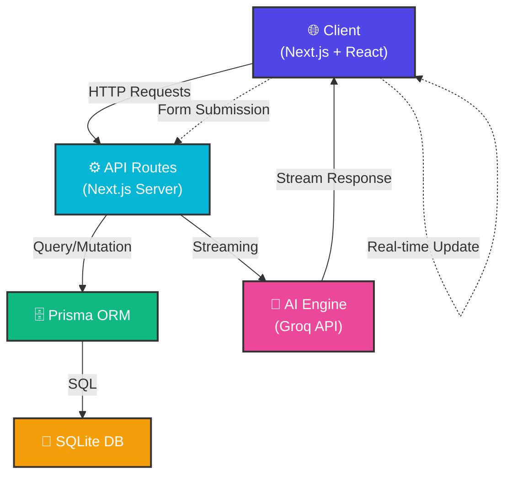
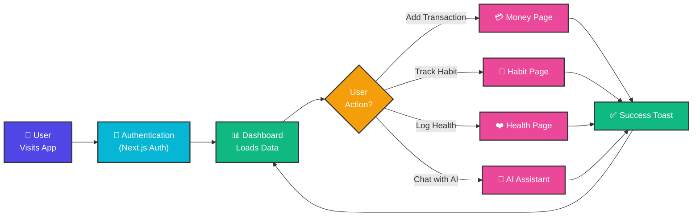
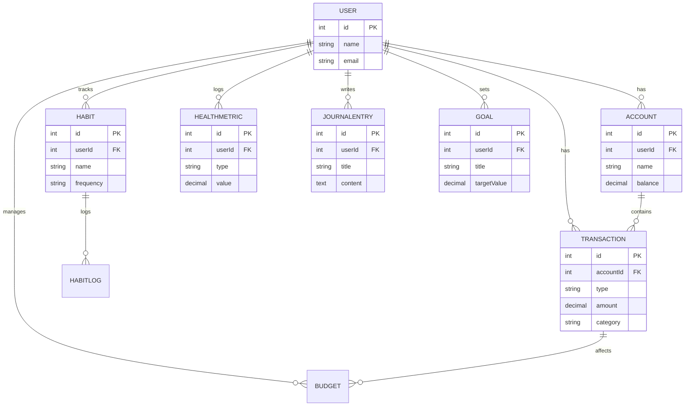

++ A:\Programming\Project\LifeOS\README.md
# <div align="center"> 🚀 LifeOS </div>

<div align="center">

### *A Personal Operating System for Life Management*

[](https://nextjs.org/)
[](https://www.typescriptlang.org/)
[](https://react.dev/)
[](https://tailwindcss.com/)
[](LICENSE)

**Comprehensive personal dashboard • Real-time health tracking • AI-powered insights • Dark mode • Mobile responsive**

[🎯 Features](#-features) • [📚 Tech Stack](#-tech-stack) • [🚀 Quick Start](#-quick-start) • [📖 Documentation](#-documentation)

</div>

---

## ✨ Hero Section

<div align="center">

### Transform Your Life Into a Manageable Operating System

LifeOS is a **next-generation personal productivity platform** that brings order to every corner of your life.

Track your **finances**, **habits**, **health**, **goals**, and **journal entries** all in one beautifully designed dashboard.

Powered by **AI-assisted insights** and built with **cutting-edge web technologies**.

```
╔════════════════════════════════════════════════════════════════╗
║                                                                ║
║          🌍 Your Life. Organized. Optimized. Automated.        ║
║                                                                ║
║     Money  →  Health  →  Habits  →  Goals  →  Journal         ║
║                         ↓                                      ║
║                    AI ASSISTANT                                ║
║                                                                ║
╚════════════════════════════════════════════════════════════════╝
```

</div>

---

## 🎯 Features

<div align="center">

### Everything You Need to Master Your Life

</div>

| Feature | Description | Status |
|---------|-------------|--------|
| 💰 **Money Management** | Track transactions, manage budgets, and visualize net worth with real-time charts | ✅ |
| 🎯 **Habit Tracking** | Build streaks, visualize progress with heatmaps, and stay accountable | ✅ |
| ❤️ **Health Metrics** | Log weight, sleep, mood, heart rate, and more with interactive charts | ✅ |
| 🎪 **Goal Progress** | Set and track goals across Finance, Health, Habits, and custom categories | ✅ |
| 📔 **Journal Entries** | Write reflections with mood tracking and "On This Day" nostalgia | ✅ |
| 🤖 **AI Assistant** | Get personalized insights, log data via natural conversation | ✅ |
| 🌙 **Dark Mode** | Eye-friendly interface for any time of day | ✅ |
| ♿ **Accessibility** | WCAG AA compliant with keyboard navigation and screen reader support | ✅ |
| 📱 **Mobile Responsive** | Seamless experience on phones, tablets, and desktops | ✅ |
| ⌨️ **Keyboard Navigation** | Full keyboard support with visible focus indicators | ✅ |

---

## 📊 Dashboard Preview

<div align="center">

### Real-time Overview at a Glance

```
┌─────────────────────────────────────────────────────────────┐
│  📊 Dashboard                                               │
├─────────────────────────────────────────────────────────────┤
│                                                             │
│  💵 Net Worth: ₹45,000  📉 Today's Expenses: ₹500         │
│  🔥 Habit Completion: 100%  ❤️ Health Metrics: 5 tracked  │
│                                                             │
│  ┌──────────────────────┐  ┌──────────────────────┐       │
│  │ Expense Chart (7d)   │  │ Budget Alert         │       │
│  │ ▆ ▆▆ ▆ ▆ ▆▆ ▆▆      │  │ Food: 60% • ₹3000   │       │
│  └──────────────────────┘  └──────────────────────┘       │
│                                                             │
│  📈 Goals   💪 Health Metrics   🎯 Quick Actions           │
│                                                             │
└─────────────────────────────────────────────────────────────┘
```

</div>

---

## 🏗️ Tech Stack

<div align="center">

### Modern, Scalable, Developer-Friendly

</div>

### Frontend & Framework
```
Next.js 16.2.6  │  React 19  │  TypeScript 5.0  │  Tailwind CSS 4.3.0
```

### UI Components & Visualization
```
Lucide React  │  Recharts  │  Radix UI  │  clsx  │  react-hot-toast
```

### Backend & Database
```
Prisma ORM  │  SQLite  │  Next.js API Routes
```

### AI & Integrations
```
Groq API (LLM)  │  OpenAI Compatible  │  Streaming Responses
```

### Development Tools
```
Turbopack  │  ESLint  │  TypeScript  │  Tailwind IntelliSense
```

### DevOps & Deployment
```
Vercel  │  GitHub  │  Environment Variables  │  ISR & SSG
```

---

## 🔄 Architecture & Data Flow

### System Architecture



### User Journey



### Database Schema (Simplified)



---

## 🚀 Quick Start

### Prerequisites

- **Node.js** 18.0 or later
- **npm** or **pnpm** or **yarn**
- **.env.local** file with API keys

### Installation

#### 1️⃣ Clone the Repository

```bash
git clone https://github.com/yourusername/lifeos.git
cd lifeos
```

#### 2️⃣ Install Dependencies

```bash
npm install
```

#### 3️⃣ Setup Environment Variables

Create a `.env.local` file in the root directory:

```env
# Database
DATABASE_URL="file:./prisma/dev.db"

# AI API (Groq)
GROQ_API_KEY="your_groq_api_key_here"

# Optional: For production deployment
NODE_ENV=development
```

#### 4️⃣ Initialize Database

```bash
npx prisma migrate dev
```

#### 5️⃣ Start Development Server

```bash
npm run dev
```

Open [http://localhost:3000](http://localhost:3000) in your browser.

---

## 📁 Project Structure

```
lifeos/
├── app/                          # Next.js app directory
│   ├── api/                      # API routes
│   │   ├── assistant/            # AI assistant endpoint
│   │   ├── habits/[habitId]/     # Habit toggle API
│   │   ├── export/               # Data export endpoints
│   │   └── cron/                 # Scheduled jobs
│   ├── (pages)/                  # Main application pages
│   │   ├── page.tsx              # Dashboard
│   │   ├── money/                # Money management
│   │   ├── habits/               # Habit tracking
│   │   ├── health/               # Health metrics
│   │   ├── journal/              # Journal entries
│   │   ├── goals/                # Goal tracking
│   │   ├── assistant/            # AI chat
│   │   ├── settings/             # User settings
│   │   └── auth/                 # Authentication
│   ├── layout.tsx                # Root layout
│   └── globals.css               # Global styles
│
├── components/                   # Reusable React components
│   ├── ui/                       # Base UI components
│   │   ├── Button.tsx
│   │   ├── Card.tsx
│   │   └── ...
│   ├── Header.tsx
│   ├── Sidebar.tsx
│   ├── HabitCheckbox.tsx
│   └── ...
│
├── lib/                          # Utility functions
│   ├── prisma.ts                 # Prisma client
│   ├── data.ts                   # Data fetching
│   ├── habitHelpers.ts           # Habit logic
│   ├── accountHelpers.ts         # Account logic
│   ├── assistantTools.ts         # AI tools
│   └── ...
│
├── prisma/                       # Database schema
│   ├── schema.prisma
│   ├── migrations/
│   └── dev.db
│
├── styles/                       # Global styles
│   └── globals.css
│
├── public/                       # Static assets
│   └── ...
│
├── package.json
├── tsconfig.json
├── next.config.js
├── tailwind.config.ts
├── prisma.config.ts
└── README.md
```

---

## 🎮 Usage Guide

### 💰 Money Management

1. Navigate to **Money** → **Accounts**
2. Add your bank accounts/investment accounts
3. Go to **Transactions** to log income/expenses
4. Set monthly budgets in **Budgets**
5. View real-time net worth on the dashboard

### 🎯 Habit Tracking

1. Navigate to **Habits**
2. Create habits with DAILY or WEEKLY frequency
3. Check off habits daily to build streaks
4. View heatmap visualization for monthly progress
5. Get AI insights on your consistency

### ❤️ Health Logging

1. Navigate to **Health**
2. Log metrics (weight, sleep, mood, heart rate, etc.)
3. View combined charts and trends
4. Set health goals and track progress
5. Export health data for professional review

### 🎪 Goal Tracking

1. Navigate to **Goals**
2. Create goals across FINANCE, HABIT, HEALTH, OTHER categories
3. Update progress as you work toward them
4. Set target dates for motivation
5. Mark as complete when achieved

### 📔 Journal Writing

1. Navigate to **Journal**
2. Write daily reflections with optional mood tracking
3. View "On This Day" entries from past years
4. Edit or delete entries as needed
5. Export journal entries for backup

### 🤖 AI Assistant

1. Open the **Assistant** chat interface
2. Ask the AI to help with:
   - Adding transactions
   - Logging habits
   - Creating journal entries
   - Getting life insights
3. Natural language understanding processes your requests
4. Real-time streaming responses

---

## ⚙️ Configuration

### Dark Mode

LifeOS automatically detects system preference. Toggle manually in **Settings**.

### Timezone Support

The app respects your system timezone for habit streaks and date calculations. For best results, ensure your device timezone is correctly set.

### Data Export

Export your data anytime:
- **Money**: CSV format with all transactions
- **Health**: CSV with all metrics
- **Journal**: Markdown or PDF format

---

## 🔐 Security & Privacy

- ✅ All data stored locally in SQLite
- ✅ No cloud analytics or tracking
- ✅ Secure password handling with Next.js
- ✅ Environment variables for sensitive data
- ✅ CORS-protected API endpoints
- ✅ WCAG AA accessibility compliant

---

## 🚀 Deployment

### Deploy to Vercel (Recommended)

```bash
# Install Vercel CLI
npm i -g vercel

# Deploy
vercel
```

### Deploy to Other Platforms

LifeOS works on any Node.js 18+ hosting:
- **Railway**
- **Render**
- **Heroku**
- **AWS**
- **Google Cloud**
- **Azure**

### Production Checklist

- [ ] Set `NODE_ENV=production`
- [ ] Configure `GROQ_API_KEY` environment variable
- [ ] Set up proper database (PostgreSQL recommended)
- [ ] Enable HTTPS
- [ ] Configure CORS properly
- [ ] Set up database backups
- [ ] Monitor application logs
- [ ] Enable rate limiting on API routes

---

## 📖 Documentation

### API Documentation

All API endpoints are documented with request/response examples:

```bash
# Get user data
GET /api/accounts/recalculate

# Toggle habit completion
POST /api/habits/[habitId]/toggle

# AI assistant chat
POST /api/assistant

# Export data
GET /api/export/transactions
GET /api/export/health
GET /api/export/journal
```

### Component Documentation

Key components:
- `Button` - Styled button with variants
- `Card` - Content container
- `HabitCheckbox` - Interactive habit completion
- `HealthCharts` - Chart visualizations
- `JournalEntryItem` - Journal entry display
- `AssistantChatComposer` - AI chat input

---

## 🧪 Testing

```bash
# Run linter
npm run lint

# Type check
npx tsc --noEmit

# Build for production
npm run build
```

---

## 🤝 Contributing

Contributions are welcome! Here's how to get started:

1. **Fork** the repository
2. **Create** a feature branch (`git checkout -b feature/amazing-feature`)
3. **Commit** your changes (`git commit -m '✨ Add amazing feature'`)
4. **Push** to the branch (`git push origin feature/amazing-feature`)
5. **Open** a Pull Request

### Commit Message Convention

```
✨ feat: Add new feature
🐛 fix: Fix bug
📚 docs: Update documentation
🎨 style: Improve UI/styling
♻️ refactor: Refactor code
⚡ perf: Performance improvements
🧪 test: Add tests
🔧 chore: Update configuration
```

---

## 📋 Roadmap

- [ ] Mobile app (React Native)
- [ ] Social features (sharing goals with friends)
- [ ] Advanced analytics dashboard
- [ ] Integration with fitness trackers (Fitbit, Oura)
- [ ] Recurring transaction automation
- [ ] Custom recurring patterns
- [ ] Data visualization improvements
- [ ] Multi-user support
- [ ] Cloud sync option
- [ ] Browser extensions

---

## 🐛 Known Issues & Limitations

- Single user per database (multi-user coming soon)
- SQLite not recommended for >100K records
- AI responses depend on API availability
- Mobile app in development

---

## 📄 License

This project is licensed under the **MIT License** - see the [LICENSE](LICENSE) file for details.

---

## 👨‍💻 Author

**Built with ❤️ by developers who believe in life optimization**

---

## 💬 Support & Feedback

- **Issues**: [GitHub Issues](https://github.com/yourusername/lifeos/issues)
- **Discussions**: [GitHub Discussions](https://github.com/yourusername/lifeos/discussions)
- **Email**: support@lifeos.local

---

## 🙏 Acknowledgments

- Built with [Next.js](https://nextjs.org/) and [React](https://react.dev/)
- Styled with [Tailwind CSS](https://tailwindcss.com/)
- AI powered by [Groq](https://groq.com/)
- Icons from [Lucide React](https://lucide.dev/)
- Charts by [Recharts](https://recharts.org/)

---

<div align="center">

### Made with 💜 for personal growth

**[⭐ Star us on GitHub](https://github.com/yourusername/lifeos)** if you find this helpful!

```
╔════════════════════════════════════════════════════════════════╗
║                                                                ║
║     🌟 Transform Your Life Into An Operating System 🌟        ║
║                                                                ║
║                    Start Building Today →                      ║
║                                                                ║
╚════════════════════════════════════════════════════════════════╝
```

[Back to Top](#-lifeos)

</div>


<p align="center">🚀</p>

Your life, quantified. Your assistant, empowered.

## Features

- 🧭 **Dashboard** — Overview of your life metrics and quick actions
- 💰 **Money** — Accounts, transactions, budgets and net worth
- ✅ **Habits** — Track streaks, completions and heatmaps
- ❤️ **Health** — Log health metrics, moods and charts
- 📝 **Journal** — Daily entries, inline edit and on-this-day history
- 🤖 **AI Assistant** — Context-aware assistant with LifeOS snapshot

## Quick Start

1. Install dependencies

```bash
npm install
```

2. Add environment variables in `.env.local` (do NOT commit this file)

Required keys (at least one AI key):

- `GROQ_API_KEY`  (Groq / OpenAI-compatible)
- `OPENAI_API_KEY` (optional fallback)
- `COHERE_API_KEY` (optional)
- `DATABASE_URL` (e.g., `file:./dev.db`)

3. Push Prisma schema to the database

```bash
npx prisma db push
```

4. Run the dev server

```bash
npm run dev
```

## Tech Stack

       

## Screenshots

| Dashboard | Money |
|---|---|
|  |  |

| Habits | Health |
|---|---|
|  |  |

## Architecture

Simple overview:

```
LifeOS (Next.js App)
├─ app/
│  ├─ dashboard (server)
│  ├─ money/ (accounts, transactions)
│  ├─ habits/ (tracking, heatmap)
│  ├─ health/ (metrics, charts)
│  ├─ journal/ (entries, on-this-day)
│  └─ assistant/ (AI chat + snapshot)
├─ lib/ (helpers + prisma client)
├─ prisma/ (schema.prisma)
└─ dev.db (local sqlite)

Flow: UI → Server Actions / API → Prisma → SQLite
AI Assistant: receives snapshot from Prisma → calls Groq/OpenAI → streams response to client
```

## Roadmap

- Mobile apps (React Native / Expo)
- Push notifications and reminders
- OAuth authentication and multi-user support
- Offline-first sync for mobile
- More AI-driven templates and workflows

## Contributing

Contributions are welcome — please open issues and PRs. Before contributing:

- Fork the repo and create a feature branch
- Keep `.env.local` and `dev.db` out of commits
- Run `npm install` and `npx prisma db push` to sync the schema
- Follow code style and add small, focused PRs

## License

This project is licensed under the MIT License — see `LICENSE` for details.

---

Made with ❤️ for building a better daily system.
# LifeOS (Next.js + TypeScript + Tailwind + Prisma)

This is a starter Next.js 14 project using the App Router, TypeScript, Tailwind CSS, and Prisma with SQLite.

Getting started:

1. Install dependencies: `npm install` or `pnpm install`
2. Run dev server: `npm run dev`
3. Initialize Prisma client: `npx prisma generate`
